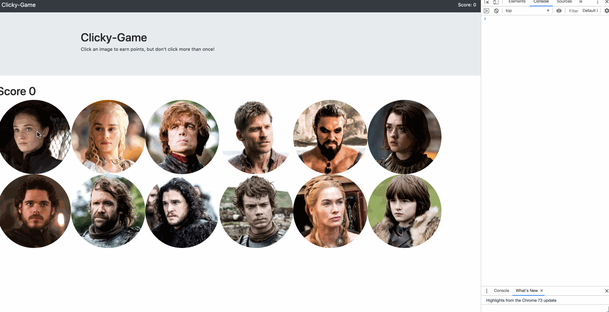

# Clicky-Game-of-Thrones
HOLY COW. I know I say this every week, but I basically spent 2 weeks on this homework assignment because... a) It's really hard and b) stinkin' projects! Anyway, that's no excuse. So on to the description.

## Game Description
In this assignment, we are using react to create a game where you click can click on a character ONLY ONCE and try to beat your top score. If you click a character more than once, the round starts over

## Note from Cami
> Okay, I didn't finish the entire logic of the game. I got lost in my own code and couldn't figure out how to get the score counter to go up.... for **DAYS**!!! Anwyay, I've got everything working now, just missing the following:

_Things I'm Missing:_

* Top Score Counter (how many times you clicked on an image without repeating)
* Error prompt when clicking an image more than once
* Nav bar doesn't show the right score

# Video Preview

